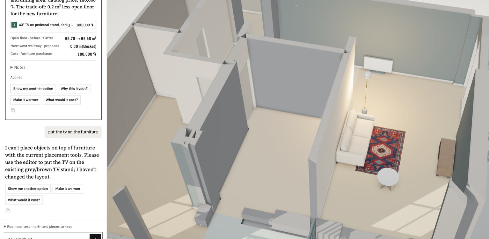

**Steps**

Designer adds '43" TV on pedestal stand, dark grey' to the living room.

**Expected**

A dark TV with a black screen.

**Actual**

Renders as a pale white box. The Kenney GLB has only two materials: metalDark (0.31,0.39,0.39) and metal (0.74,0.82,0.84); no black screen material; the light one dominates. Name says 'dark grey'. Likely other Kenney TVs/electronics have the same look — check the electronics group.

**Evidence**

**Notes**

- 2026-09-26T19:28:04.363364Z: Data fix (no code): Kenney GLBs tv-43-stand-grey, tv-crt-retro, monitor-24-grey, laptop-grey — material 'metal' (screen) → glossy near-black, 'metalDark' → charcoal; re-rendered previews, re-embedded. Published under new names *-v2.glb/.webp on VM + local (model URLs are cached immutable and the editor rejects query strings). A TV already placed before the fix keeps the old white asset: remove and re-add it.
