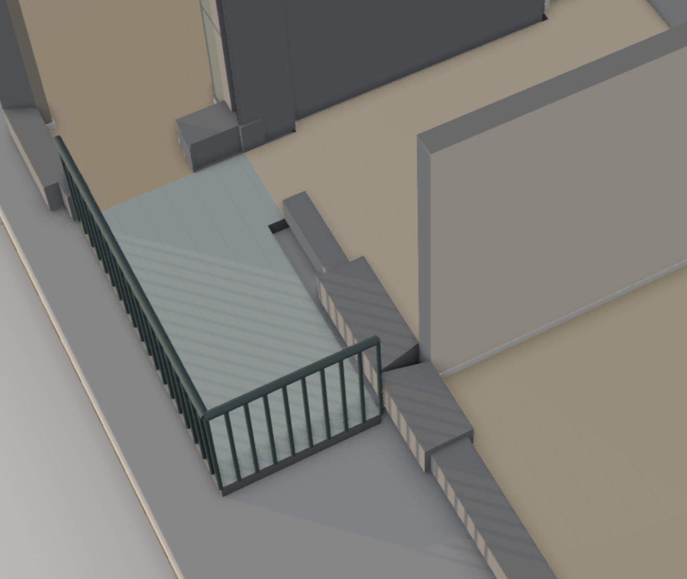

**Steps**

Open the demo flat (M6-12-54 · two balconies, plan copy) in the editor 3D view; look at the south balcony shared by both bedrooms, where the balcony wall meets the bedroom wall.

**Expected**

Wall segments meet cleanly at corners and joins: continuous thickness, no gaps, no overlapping or offset blocks.

**Actual**

Several short wall pieces along the balcony edge are offset and stepped, overlapping each other at an angle with gaps next to the partition wall, so the walls visibly don't join. Unclear whether the architect emits misaligned wall endpoints or the editor's wall-join rendering (mitre/joins) fails; check the scene's walls here first, then editor render/structure.

**Evidence**

**Notes**

- 2026-09-26T20:07:51.089902Z: Not architect output: the hand-traced M6 template (apartments/m6-12-54/trace.mjs) ran pier tail, Bedroom 1 doorway wall and south return on parallel lines 9 cm apart (x=398 vs 407 px), pier stopped 15 cm short; editor never snaps, so stepped blocks. Now one 30 px facade line at x=402 with corner joins (0 near-miss endpoints). Also fixed editor wall-geometry.ts: a T host split by normalizeWallJunctions mitred against the branch and cut a V notch (south pier at the Bedroom 2/living partition, divider pier). Saved plan copies keep the old walls; create a new copy from the template.
