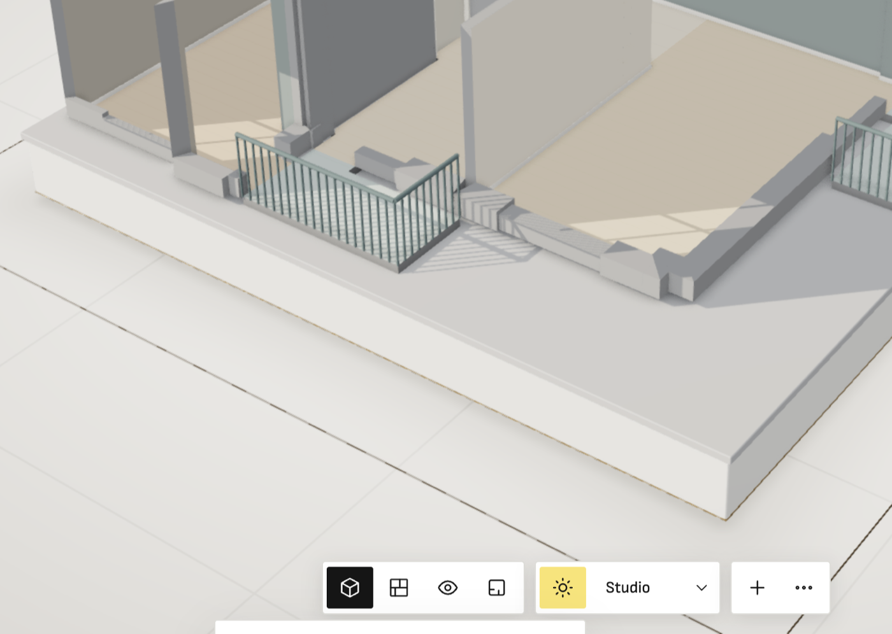

**Steps**

Editor 3D view, bottom dock (view buttons | sun + 'Studio' | + ...). Click the sun button.

**Expected**

The sun/lighting panel opens fully visible above the dock.

**Actual**

The panel opens downward from the dock and is cut off by the bottom edge of the window; only its top edge is visible (white strip under the dock). Sergey was told this was already fixed — likely a regression from the dock changes (8824146 'sky choice beside the sun in the dock', ed09f18 Folio dock) or 40a747f lighting controls. Seen on a laptop-height window.

**Evidence**

**Notes**

- 2026-09-26T20:25:36.419833Z: Fixed on main by cefbf54 (sun-controls position() opens on the roomier side, scrolls inside); verified at 1280x700: panel opens above the dock sun button, fully visible (top 60, bottom 637, dock top 645). My duplicate fix was dropped on rebase.
