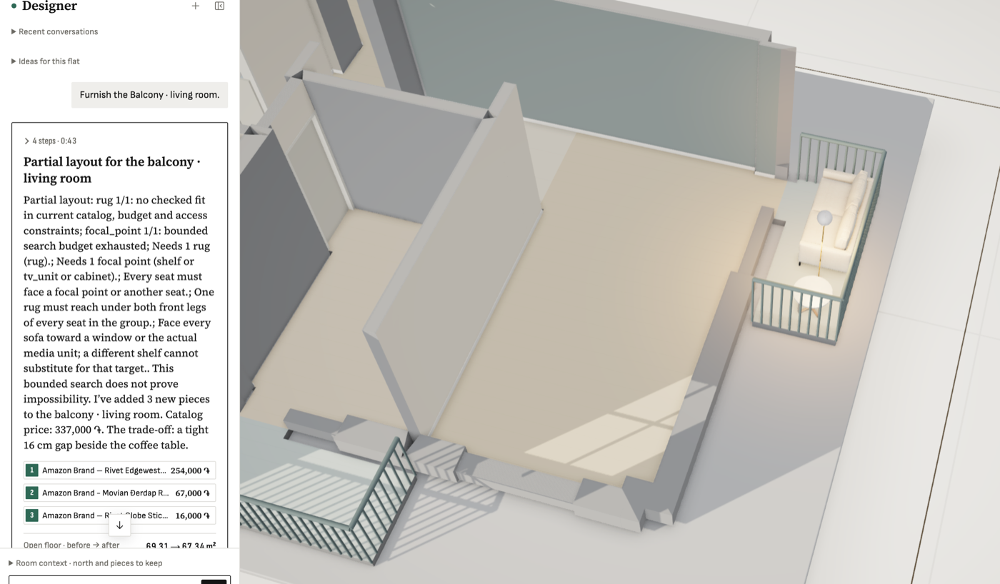

**Steps**

Designer: 'Furnish the Balcony · living room.' (room-balcony-east, 1.51 x 2.96 m).

**Expected**

A balcony program: 1-2 compact/outdoor chairs or a bench, a small bistro table, plants, maybe a lantern; nothing pushed against the railing; walkway kept.

**Actual**

Planned with the living-room program (probably because the room name contains 'living room'): a 254,000 AMD Rivet Edgewest loveseat against the railing, a floor lamp, a coffee table with a 16 cm gap, and it still reports missing rug + focal point (TV unit/shelf). The reply dumps raw rule text (rug 1/1, focal_point 1/1, 'Every seat must face a focal point...') at the user.

**Evidence**

**Notes**

- 2026-09-26T20:34:26.997070Z: Outdoor rooms (editor zone, else name) always get the balcony program: compact chair/bench, small table, plant, 0.30 m clear of railings; replay of Balcony · living room: chair+table+plant, editor accepted; partial-layout text is customer-worded (no rule codes).
