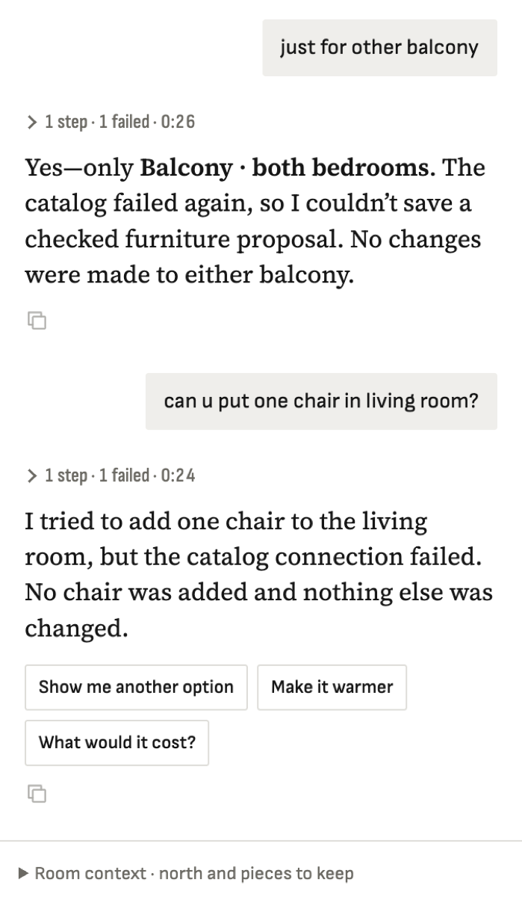

**Steps**

Local demo: designer service started with VARPET_CATALOG_URL=http://127.0.0.1:8765/mcp (no Tailscale on the laptop). Ask 'can u put one chair in living room?'.

**Expected**

search_catalog finds checked chairs, previews them, proposes.

**Actual**

search_catalog returns {ok:false, message:'fetch failed'} after ~10 s whenever it has candidates (searches with 0 candidates succeed). Repro: packages/designer/src/catalog-vision.ts candidateSheet() with VARPET_CATALOG_URL set → ok in 62 ms; with it unset → 'fetch failed' UND_ERR_CONNECT_TIMEOUT after 10.5 s (falls back to the tailnet default http://100.107.246.46:8765/mcp). So the designer MCP tool process runs the preview step without VARPET_CATALOG_URL even though search uses the configured URL. Suspect the env passed to the varpet-designer MCP server (harness/designer.py designer_mcp_env / config) or the per-turn process. Workaround applied on Sergey's laptop: ~/.config/varpet/env VARPET_CATALOG_URL=http://127.0.0.1:8765/mcp. Our local catalog is healthy (search 0.7 s, show_candidates 0.03 s).

**Evidence**

**Notes**
