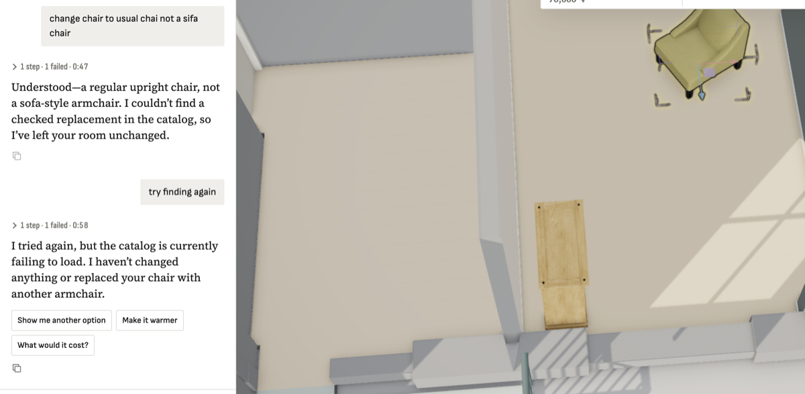

**Steps**

Local demo catalog (127.0.0.1:8765). Designer runs several search_catalog queries in parallel (e.g. 'wood chair', 'side chair', 'armless chair'), each followed by show_candidates.

**Expected**

Each search + preview sheet answers in ~1 s even when several run at once.

**Actual**

Sequential: search 0.07-1.5 s, show_candidates 0.03-0.06 s, no missing previews. 12 concurrent sessions (search_furniture + show_candidates each): every one took 4.5-8.0 s. Text queries go through SigLIP text encoding one at a time, so parallel queries queue. The designer gives each call ~10-12 s (catalog-vision.ts 12 s abort; HTTP catalog query timeout), so bursts fail as 'fetch failed' - intermittent, matching the chat ('catalog is currently failing to load'). Fix ideas: LRU cache of query text embeddings (the designer repeats queries), batch/parallel-safe encoding, fewer per-call MCP session setups, or raise designer timeouts.

**Evidence**

**Notes**

- 2026-09-26T19:56:20.474370Z: In-memory embedding matrix: single text search 0.22 s, 12 concurrent search+preview 2.5 s wall (was 6-8 s each). Deployed to VM and local.
