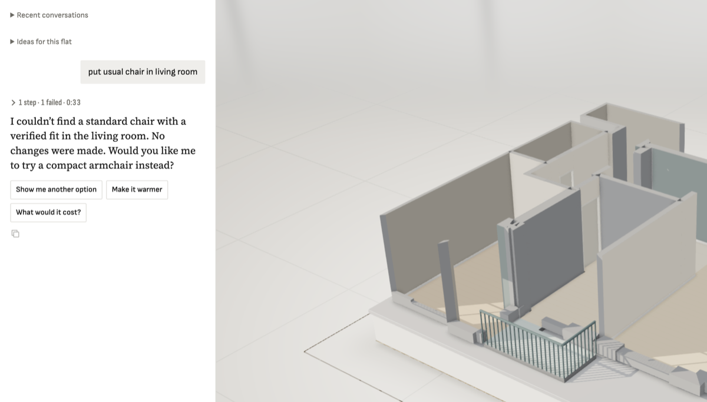

**Steps**

Designer: 'put usual chair in living room' (demo flat, living room 3.71 x 6.37 m, already has sofa, coffee table, rug, lamp).

**Expected**

A plain chair placed somewhere sensible (by the table, in a corner).

**Actual**

search_catalog {kind:chair, limit 1/6} and {text:'simple dining chair'} all return 'No checked product fit found' after ~3.6-14 s each; catalog calls themselves succeed in <0.3 s (catalog log 200s). Looks like the bed bug (f21b191): slot ranking/check budget exhausted before a valid pose, now for chairs. Earlier in the same session one accent chair did fit (abo:B07DBHJ9YF).

**Evidence**

**Notes**
