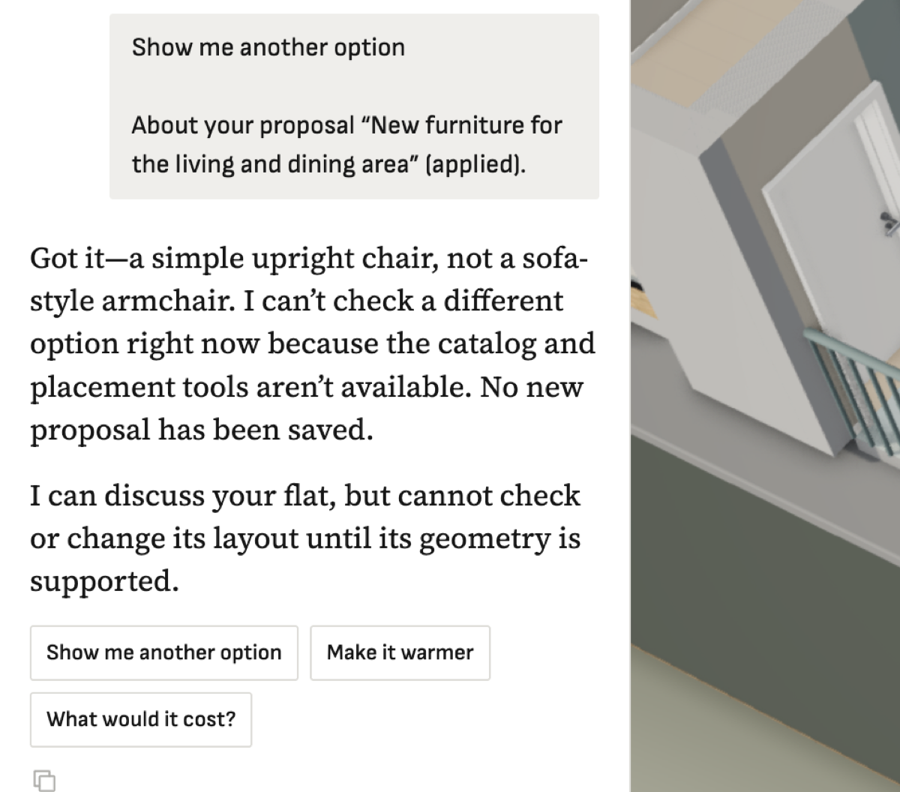

**Steps**

Scene contains one object whose catalog asset the bridge can't match (e.g. kind mismatch).

**Expected**

Designer converts the rest of the scene, treats that object as fixed/unknown (or asks), and keeps its tools.

**Actual**

editor-bridge to-designer throws 'Invalid editor scene: ... references unknown catalog asset ...'; designer_service falls back to conversation-only mode ('can't check or change its layout until its geometry is supported') for every later message. One bad item disables the designer for the flat.

**Evidence**

**Notes**
