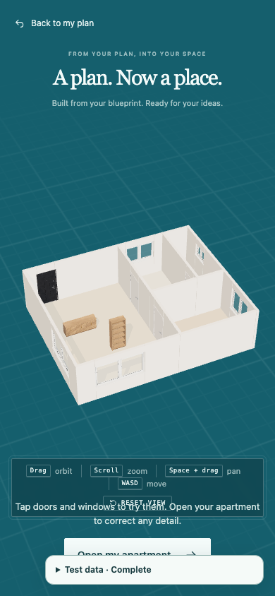

**Steps**

Open completed blueprint construction at 390 x 844. Reproduced with /?blueprintTest=complete; inspect text just above Open my apartment.

**Expected**

Navigation help and the Tap doors and windows guidance have separate readable areas.

**Actual**

The navigation/reset-view box overlaps the completion guidance. This is existing stage layout; the new development picker has separately been moved into a reserved top band.

**Evidence**

**Notes**
