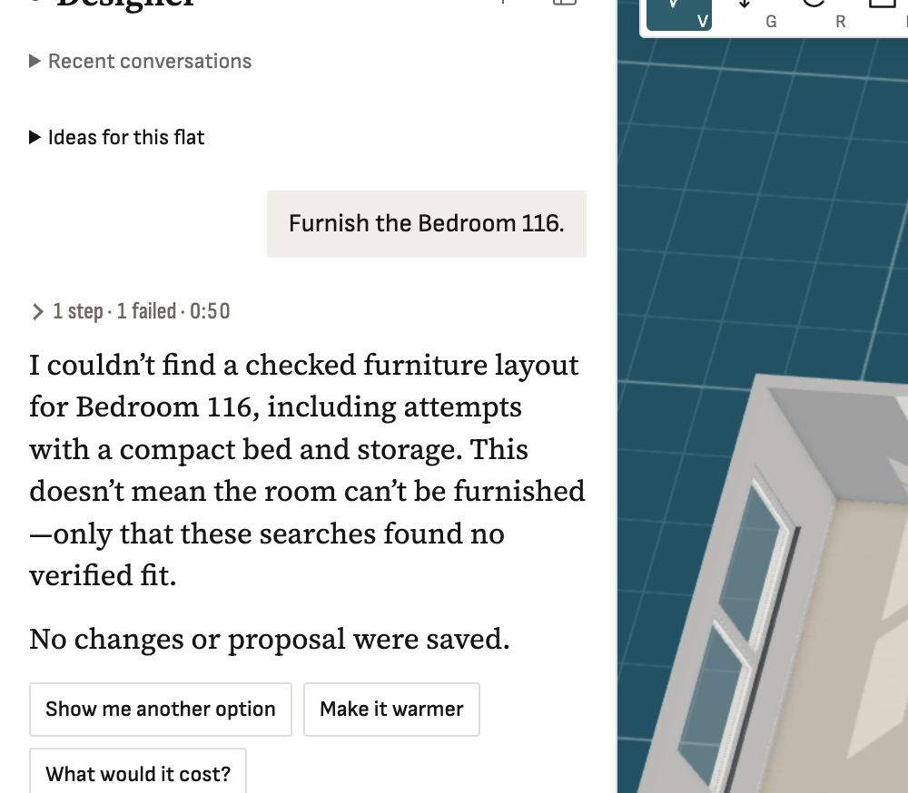

**Steps**

Import a plan through the main page (run example-floor-plans-7-20260927-014733), open it, ask the designer 'Furnish the Bedroom 116.'

**Expected**

A bed, nightstands and storage placed in an empty ~13.8 m2 bedroom.

**Actual**

plan_room(bed116, bedroom, keep heater) -> every role 'no checked fit' (19.7 s); search_catalog kind=bed 'compact single bed' -> no fit; kind=dresser -> no fit. The room is empty (0 items), 4-point polygon 3.64 x 3.78 m. The same designer places beds fine in the demo flat (f21b191 regression tests), so something in this imported scene blocks every pose - suspect openings/door swings, the heater component, or wall/room coordinate mismatch from the architect export. Exact designer scene saved at ~/Documents/varpet-upload-tests/scenes/bed116-designer-scene.json (on Sergey's laptop; ask him).

**Evidence**

**Notes**

- 2026-09-26T22:02:53.790603Z: ROOT CAUSE (diagnosed): packages/designer/src/fast-path.ts:78 requires 0.75 m door->item circulation; door ED118 is 0.74879 m wide, so every new path has a 0.00121 m deficit and line 82 rejects it -> 0 slots for bed/dresser/nightstand (313/298/343 poses, 25/244/296 geometrically eligible, all rejected on access). Documented hard minimum is 0.60 m (layout.ts:94, 0.75 preferred). Fix: use 0.6 there (verified in scratch: 6 slots each, first passes propose()), or better only reject when an item worsens the baseline deficit. Repro: catalog/data/debug-bed116/repro.ts (Sergey's laptop). Affects any imported flat with ~75 cm bedroom doors.
