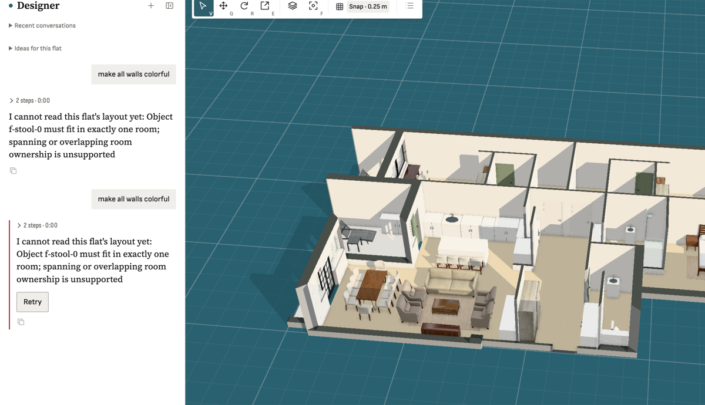

**Steps**

Furnished flat with an open kitchen/living: a bar stool (f-stool-0) at the island sits across the room boundary. Ask the designer anything, e.g. 'make all walls colorful'.

**Expected**

Designer works on the flat; an object spanning rooms is assigned to the room holding most of its footprint (or treated as fixed/unknown) and the request proceeds.

**Actual**

Immediate refusal (0:00, 2 steps): 'I cannot read this flat's layout yet: Object f-stool-0 must fit in exactly one room; spanning or overlapping room ownership is unsupported'. Retry repeats it. Even a wall-colour request is blocked. Same class as 20260926T202018Z-designer-one-unknown-catalog-asset (one bad object disables the designer for the whole flat). Common in open-plan flats (stools at islands, rugs, sofas on a boundary).

**Evidence**

**Notes**
