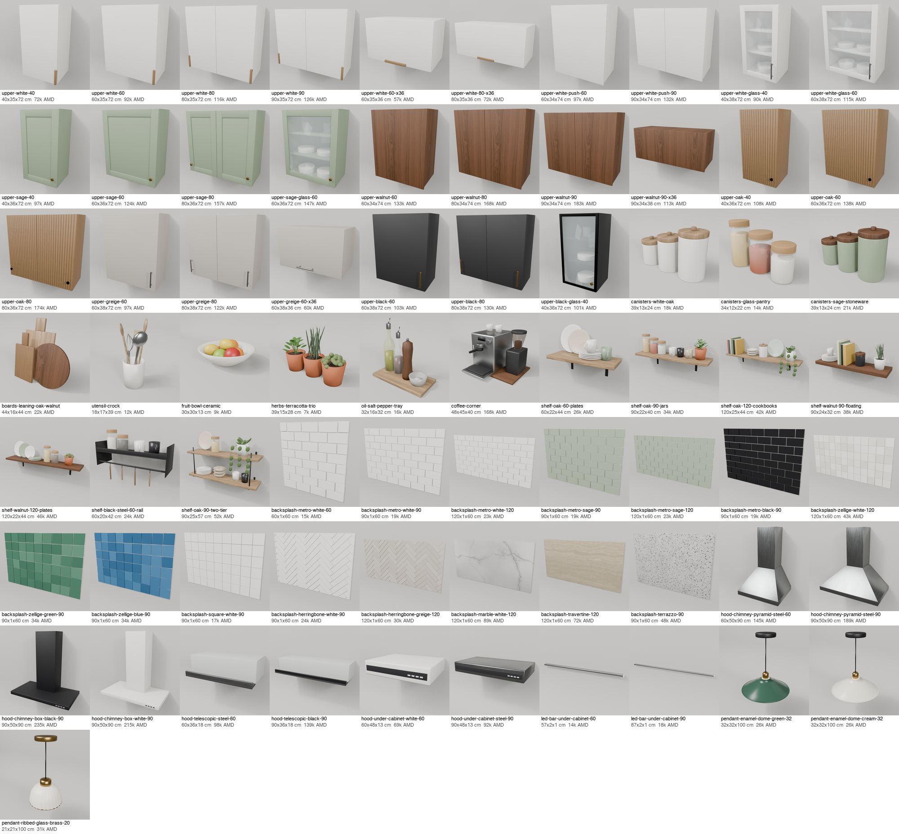

# Kitchen wall and counter (bpy): uppers, open shelves, backsplash, hoods, styling, kitchen lights

This lane covers a kitchen with base cabinets and a worktop but nothing on the wall above them. It has 71 pieces,
all generated and **not imported**. The output waits for review in `out/`, which is gitignored.



## Counts (group `bpy-kitchen`, ids `extra:bpy-kitchen:<slug>`)
| What | Kind | Placement | n | AMD |
|---|---|---|---|---|
| Wall cabinets, 72 cm high: 40/60/80/90 cm, one or two doors. Colourways: white matte with oak edge pulls; white handleless; white, sage and black-frame glass doors with crockery inside; sage shaker with brass knobs; walnut handleless; reeded oak; greige and black with bar handles | kitchen_cabinet | wall | 23 | 72-183k |
| Lift-up flap units, 36 cm high (60/80/90), for over a hood or as a bridge. Their tops line up with the 72 cm uppers | kitchen_cabinet | wall | 4 | 57-113k |
| Open shelves: oak or walnut on black L-brackets (60/90/120), floating walnut 90, black steel rail shelf 60, two-tier oak 90. Each is styled with plates, jars, mugs, cookbooks and herbs or a pothos | shelf | wall | 7 | 24-52k |
| Backsplash panels, 60 cm high, 1 cm deep. Metro (white 60/90/120, sage 90/120, black 90); zellige (off-white 120, green 90, blue 90); square white 90; herringbone (white 90, greige 120); stone slabs (marble 120, travertine 120, terrazzo 90) | backsplash | wall | 15 | 15-89k |
| Extractor hoods: chimney pyramid in steel (60/90); T-shape chimney in black or white (90); telescopic slimline (steel 60, black 90); under-cabinet canopy (white 60, steel 90) | range_hood | wall | 8 | 69-235k |
| Counter sets: three canister trios (white/oak, glass pantry, sage/walnut), leaning boards, utensil crock, fruit bowl, herb trio, oil/salt/pepper tray, coffee corner (espresso machine and grinder) | decor, bowl, plant | surface | 9 | 7-168k |
| Under-cabinet LED bars (for 60 and 90 units) | light | wall | 2 | 14-19k |
| Kitchen pendants: enamel dome 32 cm (bottle green, cream), ribbed glass bell 20 cm with brass | light | ceiling | 3 | 26-31k |

The pieces use at most 10.3k triangles, and each GLB is at most 741 kB (most are under 300 kB). Every piece has a
studio preview. The v1 `ingest_extra.py --dry-run --groups bpy-kitchen` accepts all 71.

## Anchors (glTF, Y up, metres, front +Z)
- **Wall pieces**: the origin is the bottom-back-centre. x is centred, the underside is at y 0, the back sits on the
  wall at z 0, and the front faces +Z. These are the sconce axes, with the base at 0. `mount_bottom_m` in each entry
  and its notes suggest the underside height:
  - uppers 1.44 (90 cm worktop + 54 cm)
  - 36 cm units 1.80
  - chimney hoods 1.55 (65 cm over the hob)
  - slimline/canopy hoods under a 36 cm unit 1.62/1.67
  - shelves 1.45
  - backsplash 0.90
  - LED bars 1.427 (top meets the upper's underside)
- **Surface sets**: the base centre is at y 0.
- **Pendants**: these follow the lights lane's node contract exactly. The origin is the ceiling point, with the
  nodes `canopy`/`cord`/`body` and `varpet_hang` in the root extras and in the entry's `hang`. See
  `catalog/blender/lights/README.md`. `render.py` sets the drop through it.

## Decisions for the import
- **Kinds.** v1 search (`search.py` `mount_ok`) hides every extra item tagged `wall` unless its kind is wall art,
  mirror, clock, wall hanging, curtain or blind. So in v1 none of the wall pieces show up whatever their kind. v2's
  `search_products` reads the whole catalog (`scope: all`) and lets `tags.extra.placement` win (`mount.ts`), so the
  kinds were picked for v2:
  - `kitchen_cabinet` and `shelf` are native.
  - `range_hood` already exists in the catalog (`catalog/tests/test_placeable.py`).
  - `light` matches the lights lane.
  - `backsplash` is new. The catalog has no kind for it, and `kind=` filters are exact, so search
    `kind=backsplash`.
- Prices are plausible Yerevan retail, recorded with `price_source` = mock on ingest. Uppers sit in Ashot's band
  (`gaps/batch2_kitchen.py`: 60-100 cm uppers at 112-168k). Backsplash prices are supply and fit for that panel.
  Hood prices are for mid-range appliances.
- Backsplash grout is real geometry. Each tile is a 7 mm chamfered block on a 3 mm grout bed, cut at the panel edge
  the way a tiler cuts the last row. One bmesh per panel keeps a 120 cm panel under 1k triangles and 60 kB. A
  pattern restarts at each panel edge, so two panels side by side show a seam in the bond.
- Glass is plain alpha blend (`glass:#hex@alpha` in `common.setup`) with no transmission, so three.js needs no
  transmission pass. LEDs and lit shades are emissive.

## Build
```sh
cd catalog/blender/kitchen
/opt/homebrew/bin/blender -b --factory-startup --python build.py -- [slug-substring ...]   # all when none; --list
python3 collect.py                                       # out/bpy-kitchen/entries.json + checks (anchors, budgets)
/opt/homebrew/bin/blender -b --factory-startup --python render.py -- [slug-substring ...]  # out/previews
uv run --with pillow python sheet.py                     # contact-sheet.jpg; `sheet.py out/x.jpg <family> 300` to review
```
The whole build takes about a minute, and so does the whole render. Several Blender processes can run on disjoint
slugs. On the first run, the texture library is extracted from `origin/main:catalog/materials` into `out/v1/`.

**Import** (after review) uses v1's path: copy `out/bpy-kitchen/` to `catalog/data/extra/bpy-kitchen/` and run
`catalog/import_extra_groups.sh bpy-kitchen`. Don't run these GLBs through `gltf-transform optimize` with its
defaults, because it would merge away the pendants' `cord` node.

## Files
- `common.py`: paths, texture extraction, the extra `glass:`/`glow:` specs, the registry, the anchored exporter and
  the entry record.
- `build.py`, `collect.py`, `render.py`, `sheet.py`.
- `uppers.py`, `shelves.py`, `backsplash.py`, `hoods.py`, `styling.py` (sets plus the props the shelves reuse) and
  `lighting.py`: the pieces.
- `vendor/` holds unchanged copies, each with a header line naming its source:
  - `kit.py` and `kit_shapes.py` from `../soft/vendor` (the v1 bpy kit)
  - `parts.py` from Ashot's `origin/experimental/floor-plans-3d:catalog/blender/kitchen-fitted/parts.py` (gaps,
    knob, oak edge pull)
  - `lkit.py` from `../lights` (used for the pendants)

Credit: Ashot's kitchen-fitted and gap lanes for the cabinet language and price band; the soft lane for the build,
collect and sheet pattern; the lights lane for the pendant contract and the studio render.
