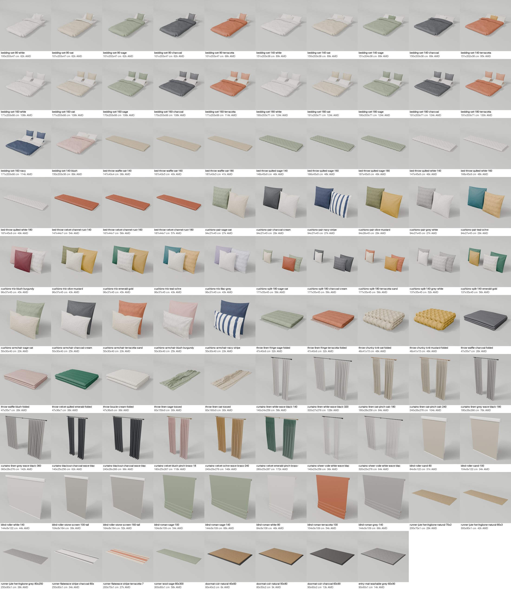

# Soft goods (bpy): bedding, cushions, throws, window textiles, runners, mats

Fills the catalog's soft-furnishing gap: sofas were left bare and beds stayed bare mattresses. 98 pieces, all
generated and **not imported**; the output waits for review in `out/` (gitignored).



## Counts (group `bpy-softgoods`, ids `extra:bpy-softgoods:<slug>`)
| What | Kind | Placement | n | AMD |
|---|---|---|---|---|
| Bedding sets: duvet turned down + sheet + pillows, per bed width 90/140/160/180 x 200; white, oat, sage, charcoal, terracotta (+ navy 160, blush 140) | throw_blanket | surface | 22 | 62-130k |
| Bed throws / quilted bedspreads folded across the foot, for 140/160/180 beds (waffle, diamond-quilted sage and white, rust velvet channel) | throw_blanket | surface | 12 | 38-57k |
| Cushion sets: pairs (6), trios (5), four-piece split pairs for 180 and 140 cm sofas (5), armchair square + lumbar (5); 10 palettes of linen, boucle, velvet, ticking stripe | cushion | surface | 21 | 23-56k |
| Sofa throws: linen with fringe, chunky knit, waffle, quilted velvet, boucle (folded), 2 tossed linen (cloth sim) | throw_blanket | surface | 10 | 26-48k |
| Curtain pairs on rods, 140-360 cm wide, 250-280 cm drop: linen, blackout, velvet, voile | curtain | wall | 13 | 36-172k |
| Roller (blackout, tall sunscreen) and relaxed roman blinds for 80/100/140/160 cm windows | blind | wall | 10 | 31-66k |
| Runners (jute herringbone, striped flatweave, wool) and coir / washable entry mats | rug | floor | 10 | 6.5-58k |

Max 43k tris and 1.5 MB per GLB; every piece has a studio preview. `ingest_extra.py --dry-run` (v1 main): 98 accepted.

## Decisions for the import
- **Bedding sets use kind `throw_blanket`** because the catalog search only returns extra items whose kind it knows
  (`search.py`: `EDITOR_KIND_OF`), and the bedroom program already asks for `throw_blanket on:bed`. Names and tags say
  "Bedding set", "duvet". Cleaner alternative: kind `bedding` plus one alias `"bedding": "decor"` in
  `select_editor_set.py` `EDITOR_KIND_OF` on the catalog host, and a re-tag of these 22 rows.
- **A bedding set sits on the mattress top**: base = mattress top, head end at the back. The duvet edge rolls down to
  the mattress top rather than hanging over the side (nothing below the base), so the set is 5-6 cm wider per side
  and ~3 cm longer than the mattress. The designer must place it at y = the mattress top, not the bed's height
  (which includes the headboard). `extra:bedding:*` (12 made-up mattresses, kind `mattress`) are different: they replace the mattress.
- Cushion sets stand on the seat and lean back ~14 degrees; split pairs need a sofa about 180 / 140 cm between the arms.
- Prices are plausible Yerevan retail (mock, `price_source` = mock on ingest).

## Build
```sh
cd catalog/blender/soft
blender -b --factory-startup --python build.py -- [slug-substring ...]   # all when none; --list to list
python3 collect.py                                                       # out/bpy-softgoods/entries.json + checks
blender -b --python vendor/render_previews_studio.py -- out/bpy-softgoods out/previews
uv run --with pillow python sheet.py                                     # out/contact-sheet.png
```
Each piece builds in well under a second (the tossed throws ~5 s); several Blender processes can run on disjoint slugs.
The texture library is extracted from `origin/main:catalog/materials` (and the v1 soft lane's `tex/`) into
`out/v1/` on first run; runner and mat textures are generated into `out/tex/`.
Import (after review) is v1's path: copy `out/bpy-softgoods/` to `catalog/data/extra/bpy-softgoods/` and run
`catalog/import_extra_groups.sh bpy-softgoods`.

## Files
- `common.py` paths, texture extraction, registry, entry record; `build.py`, `collect.py`, `sheet.py`.
- `bed.py`, `sofa.py`, `window.py`, `floor.py` the pieces.
- `vendor/` copied unchanged from v1 `origin/main` (header line names the source): `kit.py`, `kit_cloth.py`,
  `kit_shapes.py`, `soft.py` (v1 soft lane), `bedding.py` (v1 dressed beds), `textile.py` + `curtain_pieces.py`
  (v1 curtains lane), `render_previews_studio.py`.

Credit: Ashot's gap lane (`origin/experimental/floor-plans-3d:catalog/blender/gaps/`, `common.py` and
`build_textiles.py`) for the entry record, the build-and-merge pattern and how the curtains lane's builders are driven
for new widths; the v1 bpy lanes for all the cloth geometry.
