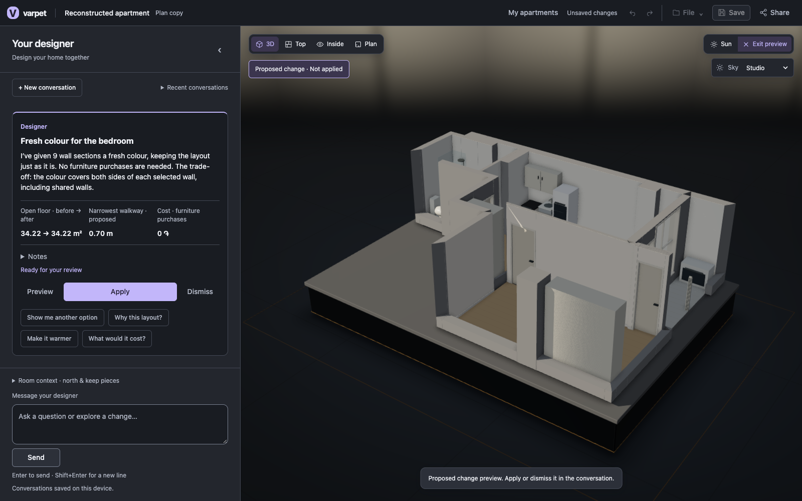
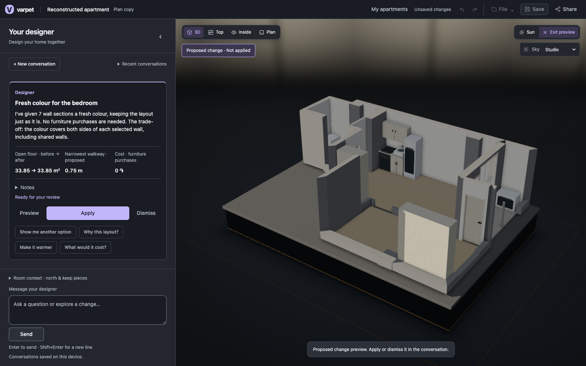
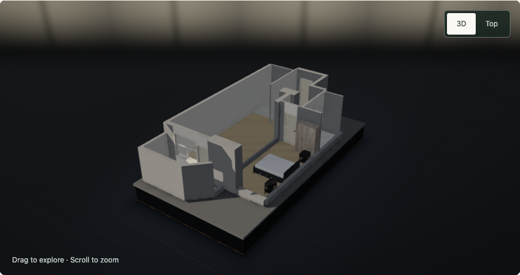
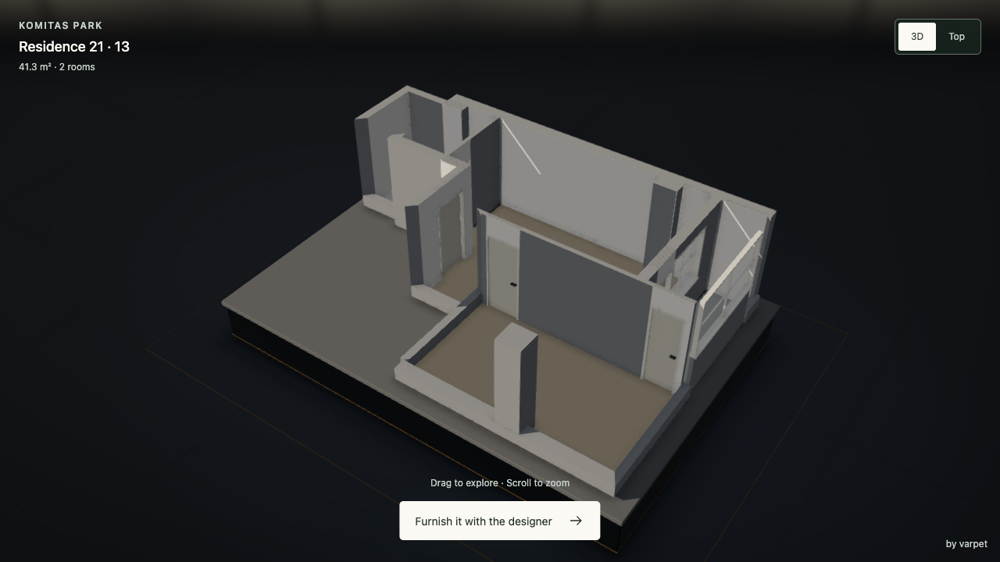

# Final integration audit — 26 September 2026

**Measured verdict: integration repair verified; furnishing is not ready end to end on this Komitas plan.** Both modes completed the six requests. Only 2 of 8 actionable requests produced proposals (paint in each mode); all 4 conversational/structural-refusal replies completed. No new furniture was placed, so sofa movement and furniture proposal approval remain unproven.

## Environment and method

- [Measured] Started from main `baad342`, in `varpet-hotfix`. Browser runs used real Chrome, the real architect SDK, real designer services and catalog; no model/API stubs. Architect: gpt-6-astra medium; designer: gpt-6-astra low, without-place / compact-base.
- [Measured] Dedicated ports: FAST designer 53110 / editor 53112; OFF designer 53111 / editor 53113; architect 53114; showcase 53115. FAST was explicitly `1`, OFF explicitly `0` (so measured default routing could not silently enable FAST). Catalog: `http://localhost:8765/mcp` and `/editor/assets`.
- [Measured] Ports 5180, 5190, 8787 and 8788 were not started, stopped or restarted. Editor storage and shares used separate temporary directories. A shared-default SQLite startup lock was avoided with per-instance storage; no database contents were changed.
- [Measured] The private `b21-t13.png` was selected through Connect → Architect LIVE → Choose plan and photos. Original image, crops, exported scenes and SDK traces stayed under `/tmp/varpet-integration-final`; none are included in this change. Showcase plan panes are masked in screenshots.
- [Measured] Browser step clocks include UI settling, evidence capture and scene exports where relevant. Showcase timings cover controls becoming interactive, not complete model downloads. These are diagnostic timings on a shared laptop, not a latency benchmark.
- [Assumed comparison constraint] Each mode independently reconstructed the same image; its geometry differs. These runs establish workflow behavior, not a controlled FAST-versus-OFF quality or speed comparison.

## Reproduced integration break and repair

[Measured] The first real architect result returned **15 BuildingComponents**. Its editor reconstruction preview and applied scene had **0**. `structureFrom()` discarded `components`, and `createReconstructionProposal()` never populated them. This silently removed the kitchen/bath/wardrobe obstacles before designer checks.

[Derived fix] The optional transport field now uses the existing `BuildingComponent` contract and existing scene validator. The live replacement copies components into `project.components`; Preview and Apply share that checked replacement, and Undo restores the complete prior scene. Legacy responses remain valid. No persisted scene schema, checker thresholds, fixtures or existing tests were weakened.

[Measured regression] `architect-components.test.mjs` first failed on dropped components and missing invalid-payload rejection; after the repair, all 3 tests pass (HTTP → preview → Apply → Undo, malformed/duplicate/missing-reference payloads, legacy omission). The two corrected live imports retained **14/14** and **15/15** component records exactly.

## Browser chain, corrected code

PASS means the stated step worked. FAIL means the customer request did not yield the requested checked change, including honest unresolved replies; it does not mean the flat is impossible.

| Step | FAST result / seconds | OFF result / seconds | Evidence / limitation |
|---|---:|---:|---|
| Portal → Avani | [PASS / 27.571](integration-final-screenshots/fast-fixed-portal.png) | [PASS / 26.430](integration-final-screenshots/off-fixed-portal.png) | Opened a real portal card and its Start with this plan link. |
| Komitas plan → architect → review | PASS / 187.125 | PASS / 238.973 | Two real SDK reconstructions of b21-t13; 5 rooms / 24 walls each. |
| Architect: Preview | [PASS / 3.929](integration-final-screenshots/fast-fixed-architect-preview.png) | [PASS / 4.206](integration-final-screenshots/off-fixed-architect-preview.png) | Actual 3D proposed shell with kitchen/bath fixtures. |
| Architect: Apply | PASS / 2.760 | PASS / 10.190 | FAST: 14/14 HTTP fixtures retained; OFF: 15/15, exact component-record equality. |
| Architect: Undo | PASS / 2.964 | PASS / 3.167 | Exported scene equals the pre-import scene exactly. Redo retains the import for following steps. |
| Furnish the living room | [FAIL / 14.035](integration-final-screenshots/fast-fixed-0-response.png) | [FAIL / 48.253](integration-final-screenshots/off-fixed-0-response.png) | FAST: search deadline. OFF: no complete physically checked options. No proposal. |
| Furnish the bedroom: a double bed, two nightstands and a wardrobe | [FAIL / 5.394](integration-final-screenshots/fast-fixed-1-response.png) | [FAIL / 59.983](integration-final-screenshots/off-fixed-1-response.png) | FAST: bounded search exhausted. OFF: headboard / reachable bedside placement unresolved. No proposal. |
| Move the sofa so it faces the window | [FAIL / 18.426](integration-final-screenshots/fast-fixed-2-response.png) | [FAIL / 8.633](integration-final-screenshots/off-fixed-2-response.png) | Neither furnishing attempt added a sofa; both correctly reported none in the scene. Requested move remains unproven. |
| Paint the bedroom walls warm white | [PASS / 4.680](integration-final-screenshots/fast-fixed-3-response.png) | [PASS / 22.149](integration-final-screenshots/off-fixed-3-response.png) | FAST: 9 wall sections, 0 AMD furniture cost. OFF: 7 sections, 0 AMD. Both require Apply. |
| Paint proposal: Preview | [PASS (visual) / 5.809](integration-final-screenshots/fast-fixed-3-preview.png) | [PASS (visual) / 3.348](integration-final-screenshots/off-fixed-3-preview.png) | PASS by visual inspection of captured Proposed change / Not applied view; see driver caveat below. |
| Paint proposal: Apply | PASS / 7.751 | PASS / 2.639 | Scene changed; all fixed fixtures remain. No furniture added. |
| Paint proposal: Undo | PASS / 2.948 | PASS / 1.424 | Exported scene equals the entire pre-paint snapshot exactly. Redo keeps paint for the conversation. |
| Why did you put the sofa there? | [PASS / 13.545](integration-final-screenshots/fast-fixed-4-response.png) | [PASS / 12.292](integration-final-screenshots/off-fixed-4-response.png) | Truthful reply: no sofa was placed. Explaining an actual furniture placement was not exercised. |
| Knock down the wall between the kitchen and the living room | [PASS / 0.842](integration-final-screenshots/fast-fixed-5-response.png) | [PASS / 10.923](integration-final-screenshots/off-fixed-5-response.png) | Structural request declined in both modes; no operations applied. |

For each of the six failed furnishing/move requests, Preview / Apply / Undo are **N/A: no proposal existed**, not passes. The two paint proposals and two reconstruction proposals each exercised all three actions.

[Measured driver caveat] The initial automation looked for `preview-mode` on `body`; the editor applies it to `#app`. It therefore emitted false FAIL flags for paint Preview. Both captured screenshots were inspected: they show the proposed 3D scene, “Proposed change · Not applied”, the preview controls and the unchanged revision. The raw flags remain in [the JSON evidence](integration-final.json); the table records the visual verdict.

### Exact unresolved replies

**FAST**

- Furnish the living room: I could not find a checked layout within the search budget. This does not prove the request impossible. Try one piece at a time or a different room.

- Furnish the bedroom: a double bed, two nightstands and a wardrobe: I could not find a checked layout in the bounded search. This does not prove it impossible. Try a smaller piece or fewer pieces first.

- Move the sofa so it faces the window: I don’t see a sofa in the supplied scene. Could you add your existing sofa to the scene so I can check a position facing the window?

**OFF**

- Furnish the living room: I tried a modest contemporary scheme with a sofa, rug, table, lamp and focal storage, retaining the fixed kitchen. The layout search couldn’t produce the required complete, physically checked options for this room. Nothing has been changed, and I don’t yet have a checked preview or confirmed catalog total to offer.

- Furnish the bedroom: a double bed, two nightstands and a wardrobe: I found matching options for all four pieces, but couldn’t produce a checked bedroom preview. The room planner couldn’t resolve a solid-wall headboard position with reachable bedside furniture, and the separate layout attempt was also rejected. The shortlisted set totals 544,000 AMD in mock catalog prices, not a shop quotation. Your built-in cupboard remains untouched; nothing has been applied or purchased.

- Move the sofa so it faces the window: There’s no sofa in the current scene—the earlier furnishing attempt didn’t add one. Please add or select your sofa in the editor so I can preview it facing the living-room window.

### Catalog and console observations

[Measured] At the initial pass, both `/health` and `/editor/assets` timed out without bytes after 5–8 seconds. A read-only probe from the SSH jump host also timed out after 5.002 seconds (HTTP 000), locating the outage upstream of this worktree. The first FAST furnishing replies reported no usable sofa/bed identities. Those outage-era results are not substituted for the corrected run above.

[Measured] At 18:37 +04:00, `/health` recovered: HTTP 200 in 0.393 s; 7,954 catalog records and 900 editor assets. `/editor/assets` returned 900 records. Corrected furnishing attempts still failed after catalog recovery: FAST hit search limits; OFF found a 544,000 AMD mock-priced bedroom shortlist but could not produce a checked layout. No placement/checking gate was relaxed during this freeze.

[Measured] Editor consoles recorded an initial `/api/catalog/search?text=&kind=` HTTP 503 during the outage and a missing `/favicon.ico` HTTP 404. No uncaught editor page exception was recorded. The favicon is a cosmetic missing asset, left unchanged under the integration-only freeze.

## Showcase pages and embeds

[Measured] Every published card was opened in both rounds. Each available As built/Furnished state and both Top/3D cameras were clicked, then its embed and both embed camera buttons. All 20 flat+embed flows passed. Showcase is read-only and does not run the designer, so the mode labels identify the audit round only. Pending states remain pending; a recorded furnished state can contain paint only, not new furniture.

| Flat | Available states | FAST round seconds | OFF round seconds | Result |
|---|---|---:|---:|---|
| b18-t1 | shell | 1.055 | 1.135 | PASS |
| b20-t11 | shell, furnished | 1.088 | 1.332 | PASS |
| b21-t13 | shell, furnished | 0.951 | 0.986 | PASS |
| b23-t64 | shell | 1.350 | 1.132 | PASS |
| b24-t22 | shell | 0.963 | 1.133 | PASS |
| b25-t72 | furnished | 1.052 | 0.904 | PASS |
| b27-t79 | shell | 1.325 | 1.039 | PASS |
| b28-t31 | shell, furnished | 1.963 | 1.106 | PASS |
| b30-t35 | shell, furnished | 1.609 | 0.880 | PASS |
| b31-t46 | shell, furnished | 1.315 | 1.043 | PASS |

[Measured] The b28-t31 furnished page subsequently loaded all three unique ABO GLBs with HTTP 200 (24.295, 26.489 and 33.375 seconds). Its four furniture instances rendered; no showcase console/page error was observed. These downloads explain why an immediately interactive view can initially show bounds. This is not evidence of newly generated furnishing in this audit.









## Verification and completion evidence

```text
VITEST_MAX_WORKERS=1 pnpm test                 exit 0 (baseline, once)
  designer: 108 files / 494 tests passed
  harness: 178 tests OK; evaluation: 45 tests OK
  showcase: 12 passed
  editor: 24 server + 139 tests passed, plus all domain checks
pnpm --filter @varpet/editor test             exit 0 (after fix)
  24 server + 142 tests passed, plus all domain checks
pnpm --filter @varpet/editor test:architect   exit 0; adapter + 41 proposal assertions
node --test .../architect-components.test.mjs 3 passed / 0 failed
pnpm typecheck                               exit 0 (after fix)
pnpm --filter @varpet/editor build            exit 0
pnpm --filter @varpet/showcase build          exit 0
```

[Measured] Build output retains existing bundle-size warnings. A reviewer mistakenly began a duplicate full-suite run; it was stopped when the explicit once-only instruction was reiterated. It is not used as completed verification evidence. The complete baseline output and final targeted outputs are in `/tmp/varpet-integration-final/`.

Definition-of-done audit: **7/7 process checks evidenced; product furnishing acceptance is not green.**

1. ✓ Browser proving scripts completed both real chains; all outcomes and seconds are recorded above and in JSON.
2. ✓ Untargeted test/typecheck evidence above; final editor suite/typecheck/builds passed. Follow the user’s post-rebase push rule, not another full suite.
3. ✓ Three new cross-boundary regressions passed after demonstrating failures before the fix.
4. ✓ Existing tests, persisted scene schema, fixtures and protected project rules unchanged. Only the optional architect transport interface was extended to retain already-exported components.
5. ✓ Fresh read-only reviewer: APPROVE for code and regression coverage. Live results are separately measured here.
6. ✓ Independent architect geometry is an explicit comparison limitation. Furnishing/search quality remains unresolved; no claim of impossibility or successful furniture placement is made.
7. ✓ Only this integration lane wrote the architect adapter, transport type, reconstruction proposal, new test, integration documentation and this report/evidence. Reviewer made no edits.

Not proven: successful living-room/bedroom purchase proposals, their Preview/Apply/Undo, or moving/explaining an actually placed sofa. These remain product failures on the tested plan rather than silently removed requirements.

[Measured] FAST designer service total: 6 turns, 42.265 s, 1 tool calls. UI times above include catalog loading and browser work.
[Measured] OFF designer service total: 6 turns, 149.471 s, 12 tool calls. UI times above include catalog loading and browser work.

[Measured, 18:45 +04] All owned test services were stopped after the audit; `lsof` found no listeners on ports 53110–53115. Protected live ports were never started, stopped or restarted.
